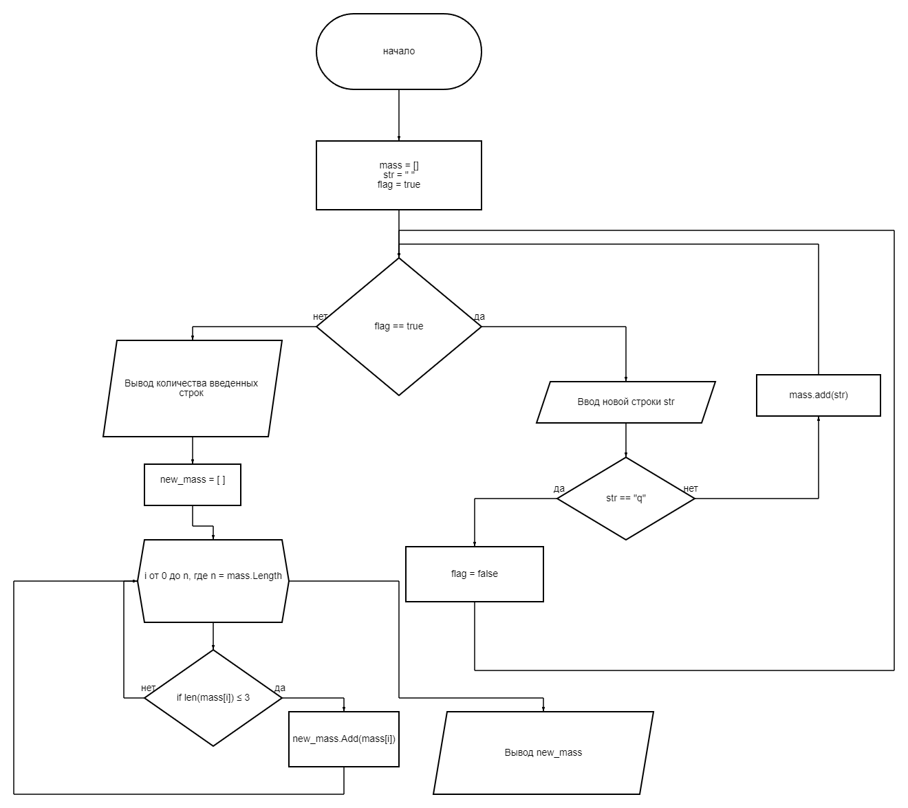

# Итоговая контрольная работа по основному блоку
### Задание:
 *Написать программу, которая из имеющегося массива строк формирует новый массив из строк, длина которых меньше, либо равна 3 символам. Первоначальный массив можно ввести с клавиатуры, либо задать на старте выполнения алгоритма. При решении не рекомендуется пользоваться коллекциями, лучше обойтись исключительно массивами.*
 
**Примеры:**
```sh
[“Hello”, “2”, “world”, “:-)”] → [“2”, “:-)”]
[“1234”, “1567”, “-2”, “computer science”] → [“-2”]
[“Russia”, “Denmark”, “Kazan”] → [] 
```
Работа была выполнена в среде разработки VSCode на языке программирования C#.

**Этапы работы:**
1. Для решения задачи было решено использовать цикличный ввод строк, затем при вводе символа "q", ввод строк прекращается.
2. Введенные строки были помещены в массив строк *mass*, затем был создан пустой массив *new_mass* в котором будут хранится строки, длина которых менее 3 символов. 
3. Был произведен цикличный перебор элементов массива *mass* и если длина строкового элемента меньше или равна(<=) 3-м символам, тогда элемент помещается в массив *new_mass*.
4. После получения строк длина которых меньше 3-х, производится вывод данных строк, т.е вывод массива *new_mass*.

**Содержание репозитория:**
* Скрин ниже, описывает алгоритм работы с помощью блок схемы.


* Каталог "Итоговая контрольная работа по основному блоку" является проектом VSCode, который написан на С#.

**Заключение**
Результат выволнения данной работы, является отражением необходимых навыков и знаний приобретенных в ходе изучения в проекте GeekBrains.
